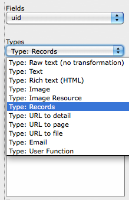

.. ==================================================
.. FOR YOUR INFORMATION
.. --------------------------------------------------
.. -*- coding: utf-8 -*- with BOM.

.. include:: ../../Includes.txt

.. _configuration-elements:

Element types
^^^^^^^^^^^^^

There are various element types that can be chosen according to your
needs:

	Selecting an element type in the mapping interface

The various element types are described below. For each one you will find
its type, a description and a link to the related TypoScript object or
function used for rendering. The links point to the TypoScript Reference.

.. _configuration-elements-raw-text:

Raw text
""""""""

Type
  Raw text

Description
  This will display the data from the database field as is, without any
  transformation. Use this whenever possible, as it gives much better
  performance.

TypoScript Object / function
   -

.. _configuration-elements-text:

Text
""""

Type
  Text

Description
  The local TypoScript is the same as for Object TEXT. The value of the
  TEXT object will be loaded with the value from the mapped database
  field.

TypoScript Object / function
  :ref:`TEXT <t3tsref:cobj-text>`

.. _configuration-elements-rich-text:

Rich text
"""""""""

Type
  Rich text

Description
  This is actually the same as the “Text”-type element, but it is
  designed to handle fields that use the RTE. Such fields need special
  rendering, so that RTE data is interpreted before display in the
  front-end. As this is not necessary with every text field, a separate
  element type exists.

TypoScript Object / function
  :ref:`TEXT <t3tsref:cobj-text>`

.. _configuration-elements-image:

Image
"""""

Type
  Image

Description
  The value from the database field will be automatically stored  **in
  the “file” property** of the object.

TypoScript Object / function
  :ref:`IMAGE <t3tsref:cobj-image>`

Default parameters
  .. code-block:: typoscript

		altText = file\_name
		titleText = file\_name

.. _configuration-elements-image-resource:

Image Resource
""""""""""""""

Type
  Image Resource

Description
  Returns only the image-reference, possibly wrapped with stdWrap. The
  value from the database field will be automatically stored **in the
  “file” property** of the object.

TypoScript Object / function
  :ref:`IMG_RESOURCE <t3tsref:cobj-img-resource>`

.. _configuration-elements-media:

Media
"""""

Type
  Media

Description
  Uses the MEDIA content object for rendering, so it can be used for
  displaying video or audio files. The value from the database field is
  used automatically for the "file" property.

TypoScript Object / function
  :ref:`MEDIA <t3tsref:cobj-media>`

Default parameters
  .. code-block:: typoscript

		type = video
		renderType = auto

.. _configuration-elements-fal-references:

FAL references
""""""""""""""

Type
  FAL references

Description
  Used for rendering data related to FAL, be it references, collections
  or folders, anything that can be handled by the FILES content object.

TypoScript Object / function
  :ref:`FILES <t3tsref:cobj-files>`

.. _configuration-elements-records:

Records
"""""""

Type
  Records

Description
  Will render records using the TypoScript RECORDS object. The value is
  expected to be a uid or have the structure "tablename\_uid" (e.g.
  tt\_content\_38). The mapped value is automatically stored
  **in the "source" property** of the object.

TypoScript Object / function
  :ref:`RECORDS <t3tsref:cobj-records>`

.. _configuration-elements-url-to-detail:

URL to detail
"""""""""""""

Type
  URL to detail

Description
  This is designed to create a link and corresponds to the typolink TS
  function. It is automatically loaded with a configuration to create a
  link to a detail view as expected by the Display Controller
  (extension: displaycontroller). It is also configured to return only
  the URL, but this can be overridden in the local TS.

  The value from the database field will be automatically stored
  **in the “additionalParams” property** of the object.

TypoScript Object / function
  :ref:`typolink <t3tsref:typolink>`

Default parameters
  .. code-block:: typoscript

		useCacheHash = 1
		returnLast = url
		additionalParams = &tx\_displaycontroller[table]=xyz&tx\_displaycontrolle[showUid]=$value

.. _configuration-elements-url-to-page:

URL to page
"""""""""""

Type
  URL to page

Description
  It should be used only for database fields who contain page id's, as
  it will create a link to said page. The value from the database field
  will be automatically stored **in the “parameter” property** of the
  object.

TypoScript Object / function
  :ref:`typolink <t3tsref:typolink>`

Default parameters
  .. code-block:: typoscript

		returnLast = url
		useCacheHash = 1

.. _configuration-elements-url-to-file:

URL to file
"""""""""""

Type
      URL to file

Description
  Meant for links to files. The value from the database field will be
  automatically stored **in the “parameter” property** of the object.

TypoScript Object / function
  :ref:`typolink <t3tsref:typolink>`

Default parameters
  .. code-block:: typoscript

		returnLast = url
		useCacheHash = 1

.. _configuration-elements-email:

Email
"""""

Type
  Email

Description
  Meant for emails. The value from the database field will be
  automatically stored **in the “parameter” property** of the object.

TypoScript Object / function
  :ref:`typolink <t3tsref:typolink>`

.. _configuration-elements-user-function:

User function
"""""""""""""

Type
  User function

Description
  It is preconfigured with a property called “parameter” which will
  contain the value from the database field. The value from the database
  field will be automatically stored  **in the “parameter” property** of
  the object.

  Additionally, since version 1.8.0, user functions have a property
  called :code:`additionalParameters` which is used to pass more parameters
  to the user function. All items in the :code:`additionalParameters` have
  :ref:`stdWrap <t3tsref:stdwrap>` capabilities. In particular, this makes
  it possible to pass data from the record currently being handled.

  **Example:**

  .. code-block:: typoscript

		additionalParameters {
			currentId.field = uid
			currentRequest.data = gp:foo
		}

  Considering the above configuration with the current record having a uid of 42
  and the GET/POST variable a value of "bar", the following would be available
  inside the user function:

  .. code-block:: php

		$configuration['additionalParameters.']['currentId'] = 42;
		$configuration['additionalParameters.']['currentRequest'] = 'bar';

TypoScript Object / function
  :ref:`USER <t3tsref:cobj-user>`
