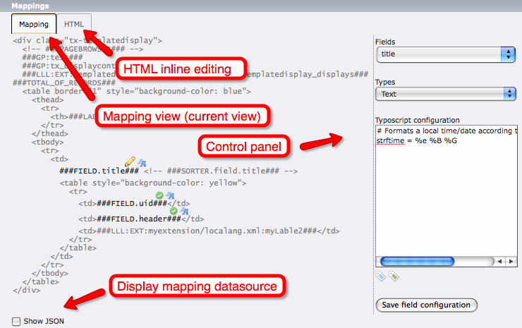
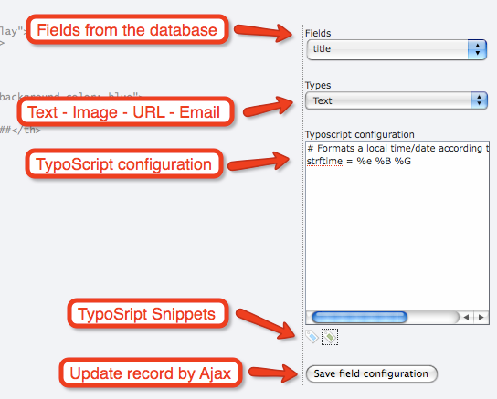

.. ==================================================
.. FOR YOUR INFORMATION
.. --------------------------------------------------
.. -*- coding: utf-8 -*- with BOM.

.. include:: ../Includes.txt

.. _introduction:

Introduction
------------

Templatedisplay is a kind of "mappable" template engine for TYPO3. The
extension is part of the Tesseract extensions family and deals with
rendering content onto the Frontend.

In short words, it enables to do a mapping between markers and
databases fields. A marker is a pattern that will be replaced
dynamically by a value coming from the database. This value can be
formatted according to some TypoScript configuration. It is also
possible to incorporate user defined markers within a hook.

Templatedisplay is well designed for rendering lists with advanced
features like sorting, filtering, page browsing. It offers a simple
syntax for looping on record set, testing condition, counting records.

.. _introduction-screenshots:

Screenshots
^^^^^^^^^^^

This is basically the default view where it is possible to map any
markers to a database's field. The mapping is done by

#. clicking on a marker (e.g. :code:`###FIELD.title###`),

#. selecting a field in the drop-down menu,

#. selecting a type within the list,

#. adding some possible additional configuration,

#. clicking the "save field configuration" button.

By using the name of the marker, Templatedisplay will tries to
identify the field in the dropdown menu "Fields". If the
correspondence fails, the filed must be selected manually in the drop-
down menu.

	Template Display's mapping interface and its various components

	Details of the mapping interface when defining rendering type and TypoScript

.. _introduction-questions:

Questions?
^^^^^^^^^^

If you have any questions about this extension, you may want to refer
to the Tesseract Project web site (http://www.typo3-tesseract.com/)
for support and tutorials. You may also ask questions in the TYPO3 English mailing list
(typo3.english).

.. _introduction-happy-developer:

Keeping the developer happy
^^^^^^^^^^^^^^^^^^^^^^^^^^^

If you like this extension, do not hesitate to make noise about it by
using the social bookmarks available in the extension's detailed view
on typo3.org:

http://typo3.org/extensions/repository/view/templatedisplay

You may also take a step back and reflect about the beauty of sharing.
Think about how much you are benefiting and how much yourself is
giving back to the community.

